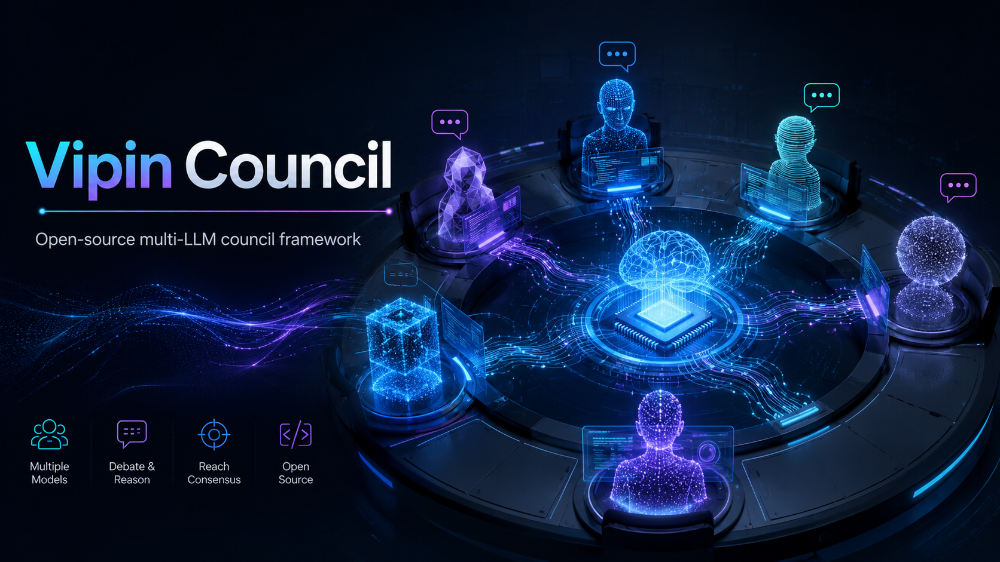

<p align="center">
  
</p>

<p align="center">
  <strong>Production-grade multi-LLM deliberation system with 6 protocols and integrated reasoning algorithms.</strong>
</p>

<p align="center">
  <a href="#quick-start"></a>
  
  
  
  
</p>

---

## What Is This?

Vipin Council is a deliberation engine that routes your query through multiple LLMs, has them critique each other, and synthesizes a final answer with confidence scoring and dissent preservation.

Instead of asking one model and hoping for the best, you get:

- **6 deliberation protocols** — council, debate, red team, consensus, specialist, tournament
- **Smart routing** — simple queries go to a fast model; complex ones trigger the full pipeline
- **Self-refine loop** — the answer is critiqued and improved up to 3 times
- **Tree of Thoughts** — beam search over candidate answers with multi-model voting
- **Task decomposition** — complex multi-part queries are broken into sub-tasks and parallelized
- **Confidence + dissent** — every answer comes with a confidence score and preserved disagreements
- **Full audit trail** — every routing decision, protocol step, and refinement is logged

---

## Architecture

```
Query In
    │
    ▼
[Smart Router] ── classify difficulty (heuristic + LLM)
    │
    ├── Simple  (< 0.25): Fast path → Haiku, instant response
    │
    ├── Moderate (0.25–0.6): Single strong model
    │
    └── Complex (> 0.6):
            │
            ▼
        [Task Decomposer] ── break into parallel sub-tasks if multi-part
            │
            ▼
        [Protocol Engine] ── run selected deliberation protocol
            │
            ▼
        [Self-Refine] ── generate → critique → refine (max 3 rounds)
            │
            ▼
        Final Answer + Confidence + Dissent + Audit Trail
```

### Integrated Algorithms

| Algorithm | Paper / Source | What It Does |
|-----------|---------------|-------------|
| Smart Router | RouteLLM (lm-sys) | Classifies difficulty, routes simple queries to fast models |
| Self-Refine | Madaan et al. 2023 | Iterative critique-and-improve loop (up to 3 rounds) |
| Tree of Thoughts | Yao et al. 2023 | Beam search over candidates with multi-model voting |
| Task Decomposer | CrewAI pattern | Breaks complex queries into specialist sub-tasks, runs in parallel |
| Peer Review | Karpathy llm-council | Anonymized cross-evaluation between models |
| Consensus Loop | Novel | Iterative convergence with agreement threshold |

---

## 6 Deliberation Protocols

| Protocol | Icon | Best For | How It Works |
|----------|------|----------|-------------|
| `council` | ⚖ | Open questions, research | All models answer → parallel peer review → chairman synthesis |
| `debate` | ⚔ | Controversial topics, trade-offs | Pro vs con → rebuttals → judge verdict |
| `redteam` | 🔴 | Testing ideas, finding flaws | Defender proposes → attacker finds weaknesses → defender improves |
| `consensus` | 🤝 | Team alignment, policy decisions | Iterative rounds until agreement threshold (70%) met |
| `specialist` | 🎯 | Domain-specific questions | Classify domain → route to expert model → verify answer |
| `tournament` | 🏆 | Finding the single best answer | Bracket elimination, head-to-head comparisons |

---

## 6-Agent Lineup

| Agent | Model | Role | Strengths |
|-------|-------|------|-----------|
| **Opus** | Claude 4.7 | Architect + Chairman | Complex reasoning, paper writing, security audit |
| **Codex** | GPT Codex Mini | Coordinator | Parallel execution, fast iteration, bulk work |
| **OpenCode** | Claude Sonnet 4.6 | Implementer | Implementation, testing, code review |
| **Sonnet** | Claude Sonnet 4.5 | Reviewer | Quality gate, verification, eligibility checks |
| **Haiku** | Claude Haiku 3.5 | Speedster | Pre-screening, fast triage, lint checks |
| **DeepSeek** | DeepSeek Chat | Bulk Worker | Translation, long generation, Chinese content |

---

## Quick Start

### Prerequisites

- Python 3.11+
- Node.js 18+ (for the React UI)
- An [OpenRouter](https://openrouter.ai) API key

### Installation

```bash
git clone <repo-url>
cd vipin-council

# Backend
pip install -e .
cp .env.example .env
# → Edit .env and add your OPENROUTER_API_KEY

# Frontend
cd frontend && npm install && cd ..
```

### Running

**Option A — one command (Windows):**
```
start.cmd
```
Opens backend on `http://localhost:8000` and frontend on `http://localhost:5173` in separate terminal windows.

**Option B — manual:**
```bash
# Terminal 1: backend
uvicorn backend.main:app --reload --port 8000

# Terminal 2: frontend
cd frontend && npm run dev

# Terminal 3: CLI
python vc.py
```

---

## CLI (`vc`)

After `pip install -e .`, the `vc` command is available globally.

### Interactive REPL

```
$ vc
```

Starts an interactive session. Type your question and press Enter.

```
  ⚡ Vipin Council  v2.0
  Multi-LLM Deliberation System
────────────────────────────────────────────────────────────────────────────────
  Type your question and press Enter.  /help for commands

  ⚖ council › What is the best architecture for a real-time recommendation system?
```

### REPL Commands

| Command | Description |
|---------|-------------|
| `/protocol <name>` | Switch protocol: `council`, `debate`, `redteam`, `consensus`, `specialist`, `tournament` |
| `/verbose` | Toggle verbose mode — shows all stages and audit trail |
| `/sessions` | List recent sessions |
| `/models` | List configured models and roles |
| `/status` | Check backend health |
| `/clear` | Clear screen |
| `/help` | Show help |
| `/quit` | Exit |

### One-Shot Mode

```bash
vc "What is the best way to learn Rust?"
vc "Should I use microservices?" -p debate
vc "My startup idea: X" -p redteam
vc "Explain transformers" -p tournament -v
```

### Session Management

```bash
vc sessions              # list recent sessions
vc show abc123           # replay session by ID prefix
vc models                # list configured models
vc protocols             # list all protocols
vc status                # check backend health
```

---

## REST API

The backend exposes a clean REST API. Interactive docs at `http://localhost:8000/docs`.

### Submit a query

```bash
curl -X POST http://localhost:8000/api/query \
  -H "Content-Type: application/json" \
  -d '{"query": "What is a monad?", "protocol": "council"}'
```

### Response format

```json
{
  "session_id": "550e8400-e29b-41d4-a716-446655440000",
  "protocol": "council",
  "stages": [
    {"name": "First Opinions", "responses": {"anthropic/claude-opus-4": "..."}},
    {"name": "Peer Review", "reviews": {...}},
    {"name": "Chairman Synthesis", "final": "...", "confidence": 0.87}
  ],
  "final_answer": "The synthesized, refined answer",
  "confidence": 0.87,
  "dissent": ["Model X disagrees because..."],
  "audit_trail": [
    {"step": "routing", "tier": "full_council", "difficulty": 0.72},
    {"step": "protocol", "name": "council", "stages": 3},
    {"step": "post_refine", "iterations": 2, "final_score": 8.5}
  ]
}
```

### Other endpoints

| Method | Endpoint | Description |
|--------|----------|-------------|
| `GET` | `/api/health` | Health check |
| `GET` | `/api/models` | List configured models |
| `GET` | `/api/protocols` | List available protocols |
| `GET` | `/api/sessions` | List recent sessions (last 50) |
| `GET` | `/api/sessions/{id}` | Get a specific session |

---

## Project Structure

```
vipin-council/
├── backend/
│   ├── main.py                    # FastAPI app, CORS, endpoints
│   ├── config.py                  # 6-agent configuration
│   ├── council/
│   │   ├── orchestrator.py        # Full pipeline: route → decompose → protocol → refine
│   │   └── session.py             # Session and SessionResult dataclasses
│   ├── engine/
│   │   ├── smart_router.py        # RouteLLM-style difficulty classification
│   │   ├── self_refine.py         # Generate → critique → refine loop
│   │   ├── tree_of_thoughts.py    # Beam search with multi-model voting
│   │   └── task_decomposer.py     # Parallel sub-task execution
│   ├── protocols/
│   │   ├── council_protocol.py    # Parallel peer review + chairman synthesis
│   │   ├── debate_protocol.py     # Pro vs con + judge
│   │   ├── redteam_protocol.py    # Defend → attack → improve
│   │   ├── consensus_protocol.py  # Iterative convergence
│   │   ├── specialist_protocol.py # Domain routing + verification
│   │   └── tournament_protocol.py # Bracket elimination
│   ├── providers/
│   │   └── router.py              # OpenRouter API client (parallel queries)
│   └── memory/
│       └── tracker.py             # Cross-session model performance tracking
├── frontend/
│   ├── src/
│   │   ├── App.jsx                # Root component, session state
│   │   ├── api.js                 # REST API client
│   │   └── components/
│   │       ├── Sidebar.jsx        # Session list, collapsible
│   │       ├── ChatPane.jsx       # Query input, protocol selector
│   │       └── ResultView.jsx     # Stages, confidence bar, dissent, audit trail
│   ├── package.json
│   └── vite.config.js
├── data/sessions/                 # Saved deliberation sessions (JSON)
├── vc.py                          # CLI tool (interactive REPL + one-shot)
├── start.cmd                      # Windows one-command launcher
├── pyproject.toml
└── .env.example
```

---

## Comparison

| Feature | llm-council | AutoGen | CrewAI | **vipin-council** |
|---------|:-----------:|:-------:|:------:|:-----------------:|
| Deliberation protocols | 1 | 0 | 0 | **6** |
| Smart routing | ✗ | ✗ | ✗ | **✓** |
| Self-refine loop | ✗ | ✗ | ✗ | **✓** |
| Tree of Thoughts | ✗ | ✗ | ✗ | **✓** |
| Task decomposition | ✗ | ✓ | ✓ | **✓** |
| Confidence scoring | ✗ | ✗ | ✗ | **✓** |
| Dissent preservation | ✗ | ✗ | ✗ | **✓** |
| Cross-session memory | ✗ | ✗ | ✗ | **✓** |
| Full audit trail | ✗ | Partial | Partial | **✓** |
| Interactive CLI | ✗ | ✗ | ✗ | **✓** |
| React UI | ✓ | ✗ | ✗ | **✓** |

---

## Configuration

Edit `backend/config.py` to change models, roles, or thresholds.

```python
# Switch the chairman
chairman: str = "anthropic/claude-opus-4"

# Adjust confidence threshold for consensus protocol
confidence_threshold: float = 0.7

# Max consensus rounds before giving up
consensus_rounds_max: int = 5
```

Set your API key in `.env`:

```
OPENROUTER_API_KEY=sk-or-...
```

---

## License

MIT
